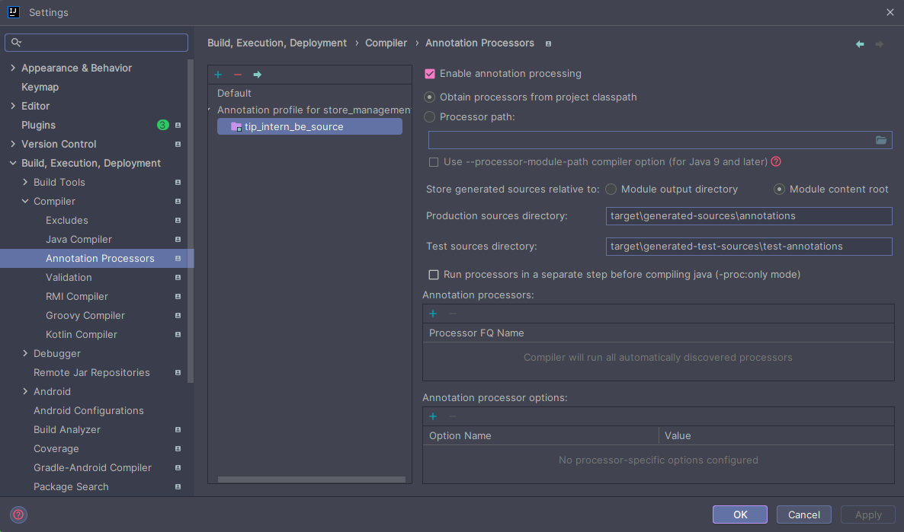
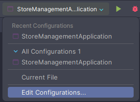
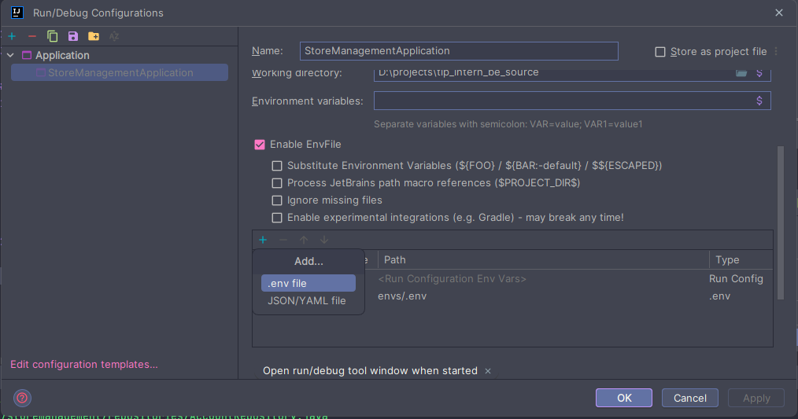
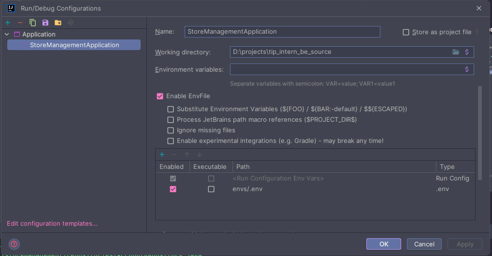

# Vehicle management

### I. Required
1. IDE: Intellij Community Edition
    * Plugins:
        * Lombok
        * EnvFile
2. Java: version 21
3. Database: MySQL version 8.x

### II. Setting
1. Enable lombok annotation
    * File > Setting > Build, Execution, Deployment > Compiler > Annotation Processors
    * Select project
    * Click the checkbox Enable annotation processing
    * Click the radio Obtain processors from project classpath
    * Click the radio Module content root
    * Click Apply > OK
    * Example:   
2. Create a .env file inside the envs folder using .env.template as a base to generate the necessary environment variables
3. Add env file
    * Open Edit configuration tab   
    * Click the checkbox Enable EnvFile > Click the add icon and import the env file   
    * Click Apply > OK   